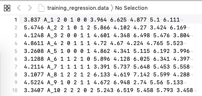
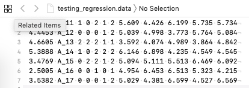

<p align="center">
  
</p>

   **BLasso** is fortran code to implement Bayesian Lasso in a genome-enabled prediction framework

# Introduction
This manual describes how to use the program BLasso, which is focused on the analysis of genomic data using Bayesian LASSO. BLasso can analyze continuos and categorical traits. 

The code is written in fortran, with GNU GPL license. The program is compiled to run in all kind of platforms (windows, linux, mac, ..).


# Purpose
This manual does not aim to thoroughly describe the methodology behind Bayesian LASSO, but to be a self-explanatory guide to implement BLasso in user's own data. Statistical details fro Bayesian Lasso can be found in [1] and [2]. The user is encouraged to consult them for details. This is a developing software, therefore any feedback on possible bugs, problems, running errors or suggestions are welcome and encouraged.

# 1 - How to execute BLasso

Download the executable file for your operating system:
MacOSX .
Linux .

BLasso must be run in a command line mode. The execution is simple, just type in the command line the following:

```
./BLasso_'system'.x 
```

BLasso needs a parameter file named 'param.bl' 

>Caution:  
>  store different runs in different folders, or BLasso may overwrite previous results.
The program will prompt the residual variance and posterior mean of the intercept every 500 iterations.


# 2 - Input Files

## Data files
The program needs two input files: a training set and a testing set. Feature coefficients will be inferred using the training set, whereas the testing set will be used to predict genome-enabled breeding values. Both files must have the same format, with p+2 columns separated by spaces. First column is the numerical response variable (linear or categorical phenotype). Second column is the alphanumeric ID of the individual. Then, p columns with the value of each feature (SNP code, allele dose or dummy variable for other systematic effects). 

```
outcome ID s1 s2 s3 s4 s5 s6 s7 s8 s9 s10 s11 s12 s13 s14 s15 s16 s17 s18 s19 s20
```

In case that predictions are not neccesary, the user must still provide a testing set. Just copy a few lines of the training file to create a testing file, and use it as if it were a real testing file. Then, discard the 'testing.pred.txt' file.

### Example of regression problems:

* *Training Data file* *




* *Testing Data file* *




## param.bl file 
Below is an example of the *param.bl* file.


The use will need to change the following parameters in the file:


- *training_file*     ```A string with the name or path to the training file``` 
- *testing file*       ```A string with the name or path to the testing file``` 
- *Number of covariates in the model*     ```Number of features in the files```
- *A priori mean for residual variance* ```Àprior mean for residaul variance and the degrees of freedom in the following row```
- *Name* ```Name of the trait to be analyzed```
- *0 or 1* ``` '1' if threshold trait; '0' if linear trait. IF '1': introduce number of categories in the next line.```
- *Chain lenght* ``` Number of Gibbs sampling iterations```
- *Burn in period* ```Number of samples to be discarded for final statistics```
- *ve* ```Initial value for residual variance```
- *lambda* ```Initial value for lambda parameter```

The text must be kept in the parameter file for clarification, and change the values provided in the parameter file provided as an example.


**Note:** the param.bl file must be in the same directory as BLasso.x.


# 3 - Output files


- *CONVERGENCE.trait* -- The file provides the conditional samples for the lambda, mu and scale (in this order) at each Gibbs sample iteration for post Gibbs analysis.

- *VAR_DISTRIB.trait* -- The first column of this file provides the conditional samples for the residual variance at each Gibbs sample iteration for post Gibbs analysis.

- *SOL_SNPs.trait* -- This file is organized in columns ordered by feature in the input file. Second column is the order of the feature in the input file, and third column is the posterior mean of effect estimate. Four column is the prediction error variance for the estimate.

- *GEBV_GRS.txt* -- This file contains three columns. The first one is the corresponding ID of individuals in the training set. The second one is the corresponding phenotype provided in the training set. The third column is the estimated value from Bayesian LASSO regression. 

- *testing.pred.txt* -- This file contains three columns. The first one is the corresponding ID of individuals in the testing set. The second one is the corresponding phenotype provided in the testing set. The third column is the estimated value from Bayesian LASSO regression for individuals in the testing set. 


# Brief summary of result

An Rmarkdown file is provided [here](BLasso_OutputSummary.Rmd) to help with a first preliminary analysis of the results in R.

# Bibliography

[1] Park and Casella. The Bayesian LASSO. Journal of the American Statistical Association. Volume 103, 2008 - Issue 482.

[2] Gonzalez-Recio O. and S. Forni. 2011. Genome-wide prediction of discrete traits using bayesian regressions and machine learning. Genetics Selection Evolution volume 43: 7.


# FAQ


 
